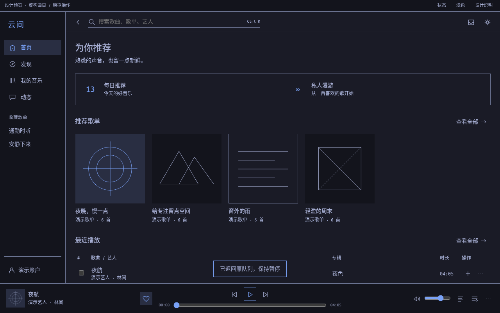

# 云间 · Yunjian

A native NetEase Cloud Music desktop app for Omarchy, designed around normal consumer QR login and system Qt6/libmpv libraries. No developer registration or business partnership is required by the selected integration. The consumer protocol implementation is unofficial.

**Status: reviewed design; native implementation in progress.** Live account functionality and complete feature parity are not yet verified.

- [Design](docs/design/DESIGN.md)
- [Complete feature ledger and current gaps](docs/design/COVERAGE.md)
- [Five independent reviews and resolutions](docs/design/REVIEWS.md)
- [Interactive preview](docs/design/preview.html) — open locally in a browser; fictional data, no service connection.

The planned app uses C++20, Qt6/QML, a native consumer-service adapter, system libmpv/PipeWire, SQLite and Secret Service. Appearance follows the active Omarchy palette, system monospace font and compositor geometry.

Full-release claims are gated on the required feature ledger, including authenticated playback, native video, cloud/offline behavior, social functions and the named protocol investigations.
