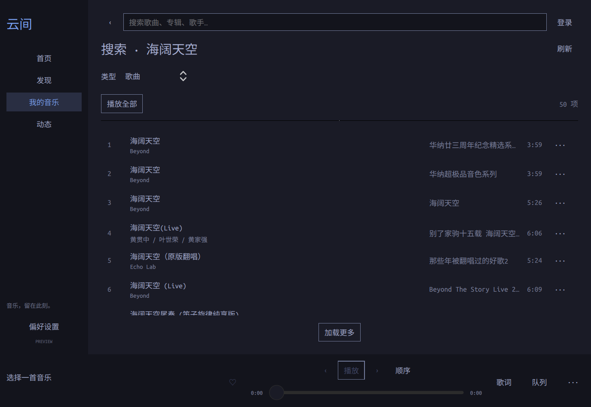

# 云间 · Yunjian

A native NetEase Cloud Music desktop app for Omarchy, designed around normal consumer QR login and system Qt6/libmpv libraries. No developer registration or business partnership is required by the selected integration. The consumer protocol implementation is unofficial.

**Status: native development preview.** The reviewed design and a working C++/QML app are included. Authenticated features and complete parity remain unverified; see the [implementation status](docs/IMPLEMENTATION.md).

- [Design](docs/design/DESIGN.md)
- [Complete feature ledger and current gaps](docs/design/COVERAGE.md)
- [Five independent reviews and resolutions](docs/design/REVIEWS.md)
- [Interactive preview](docs/design/preview.html) — open locally in a browser; fictional data, no service connection.



The screenshot above is the native app. The HTML design preview remains separate.

The app uses C++20, Qt6/QML, a native consumer-service adapter, system libmpv/PipeWire, SQLite and Secret Service. Appearance follows the active Omarchy palette, system monospace font and compositor geometry.

Full-release claims are gated on the feature ledger. Authenticated playback, cloud uploads, advanced social functions, Together, audiobooks and protected offline behavior still require implementation or acceptance work.

## Build and run on Omarchy / Arch

Use system packages: `base-devel qt6-base qt6-declarative qt6-wayland qt6-imageformats mpv libsecret openssl qrencode taglib zlib`.

```sh
mkdir -p build
qmake6 -o build/Makefile yunjian.pro
make -C build -j4
./build/yunjian
```

Install the app and launcher entry without root access:

```sh
scripts/install-local.sh
```

Open **云间** from the launcher, or run `yunjian`.

Launch with `--login` to show the NetEase consumer QR login. Normal mobile-account confirmation is required; developer registration is not. Session cookies are stored through Secret Service, never in repository files. The UI follows the current Omarchy theme and system monospace font.

Keyboard: `Ctrl+K` search, `Alt+Left` back, `Ctrl+Space` play/pause, `Ctrl+Left/Right` previous/next, `Ctrl+L` lyrics, `Ctrl+O` local files, `Ctrl+Q` quit. Media keys use MPRIS.

## Verification

Transport tests use independent crypto fixtures; model tests cover duplicate queues, reordering, shuffle history, lyrics and typed comment identity. Node is used only by these development tests and fixture generation, not by the app.

```sh
node tests/models.test.cjs
mkdir -p build/crypto-test
qmake6 -o build/crypto-test/Makefile tests/crypto_test.pro
make -C build/crypto-test -j4
./build/crypto-test/crypto-test tests/transport-vectors.json
QT_QPA_PLATFORM=offscreen QT_QUICK_BACKEND=software ./build/yunjian --smoke-test
```

For the complete automated checks, run `scripts/check.sh`. For the native graphics and live anonymous search checks, run `YUNJIAN_NATIVE_TESTS=1 YUNJIAN_LIVE_TESTS=1 scripts/check.sh` in a graphical D-Bus session. Development tests also need Node and FFmpeg.

[Verification results and limits](docs/verification/2026-09-13.md) · [Current implementation and remaining work](docs/IMPLEMENTATION.md)

Protocol reference attribution is in [THIRD_PARTY.md](THIRD_PARTY.md). Native video uses [Qt's OpenGL framebuffer integration](https://doc.qt.io/qt-6/qquickframebufferobject.html), and desktop playback follows [MPRIS](https://specifications.freedesktop.org/mpris/latest/Player_Interface.html).
