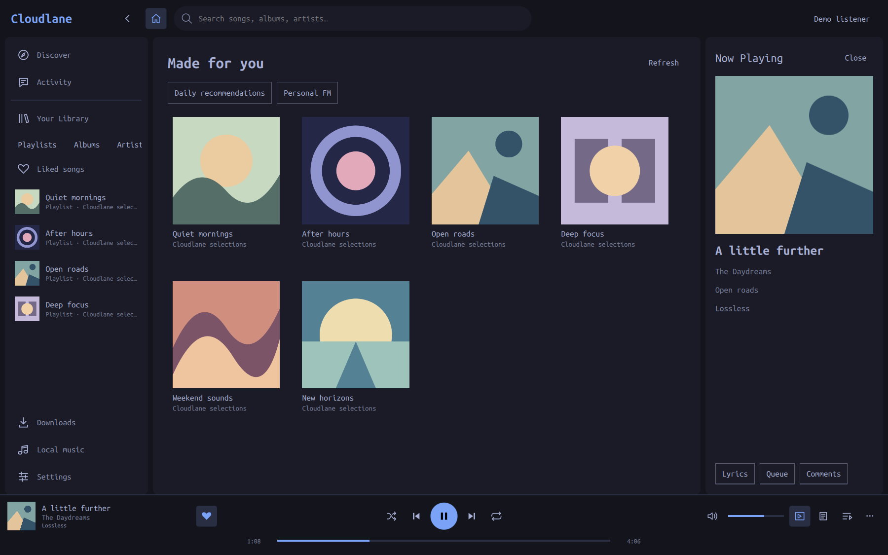

# Cloudlane

A native NetEase Cloud Music app for Omarchy. A library sidebar, central browsing view and standard desktop player, using your system's colors and monospace font.



*Actual Qt application, captured with fictional tracks, original demo artwork and generic playlists. No personal account information is shown. Reproduce it with `scripts/screenshot.sh`.*

**Development preview.** QR sign-in, saved-session restoration, playlists, recommendations, search and a native player are implemented. Feature coverage and account acceptance still have gaps; see [implementation status](docs/IMPLEMENTATION.md). This is an independent app using an unofficial implementation of NetEase's consumer protocol. It is not affiliated with NetEase or endorsed by Omarchy.

## What is included

- Home recommendations, Discover, search, playlists and library browsing.
- Play/pause, previous/next, shuffle/repeat, seek, volume/mute, lyrics and queue.
- Native audio/video through system libmpv, local-file import and a download engine.
- Consumer QR sign-in and system-keyring session storage. No developer registration is required.
- Automatic Omarchy color updates, English interface, system monospace font and MPRIS media-key support. Music titles, lyrics and other service content retain their original language.
- An optional Omarchy Quattro bar widget to open Cloudlane and control its player.

C++20, Qt6 Quick, OpenSSL, libmpv, SQLite, Secret Service, TagLib and libqrencode. Node is used only for development tests; there is no web or Node service runtime.

## Install the desktop app

On Omarchy / Arch, install the distribution dependencies if needed:

```sh
sudo pacman -S --needed base-devel git qt6-base qt6-declarative qt6-wayland qt6-imageformats mpv libsecret openssl qrencode taglib zlib
```

A working Wayland session, PipeWire audio and a Secret Service provider are expected; the normal Omarchy desktop supplies them. No libraries are vendored or replaced by the installer.

```sh
git clone https://github.com/charleszheng44/cloudlane.git
cd cloudlane
scripts/install-local.sh
cloudlane
```

The installer builds into `build/` and installs under `~/.local`. Open **Cloudlane** from the app launcher. Use `cloudlane --login` to open QR sign-in. A normal NetEase account and phone confirmation are needed for account features.

For a system package, an optional VCS [PKGBUILD](packaging/PKGBUILD) is included. It builds the repository's current Git revision; it is not an AUR listing or a published binary release. Local verification is on x86_64 Omarchy 4.0.3.

Build without installing:

```sh
mkdir -p build
qmake6 -o build/Makefile cloudlane.pro
make -C build -j4
./build/cloudlane
```

Set `CLOUDLANE_PREFIX` to change the local install location and `CLOUDLANE_JOBS` to change parallel build jobs. Updates use `git pull --ff-only` followed by `scripts/install-local.sh` and an app restart.

Remove the local installation:

```sh
scripts/uninstall-local.sh
```

The uninstaller retains your account, library and downloads. Sign out inside Cloudlane first if you want its saved account removed. See [data and permissions](SECURITY.md) for storage locations and migration details. Package-managed installations should be removed through the package manager.

## Optional Omarchy plugin

The full app runs separately from the shell. The repository root [manifest](manifest.json) exposes one **bar widget**, following Omarchy Quattro's plugin contract. Install the desktop app first; `omarchy plugin add` does not build native dependencies or execute install hooks.

```sh
omarchy plugin add https://github.com/charleszheng44/cloudlane.git
omarchy plugin enable io.github.charleszheng44.cloudlane
```

Click the music icon to open Cloudlane. When its MPRIS player is present, horizontal bars also show previous, play/pause and next controls. Vertical bars keep the launcher. Tooltips, keyboard focus, colors and font follow the host bar. The widget addresses only Cloudlane's MPRIS player and does not read account cookies or playlists.

```sh
omarchy plugin validate .
omarchy plugin update io.github.charleszheng44.cloudlane
omarchy plugin disable io.github.charleszheng44.cloudlane
omarchy plugin remove io.github.charleszheng44.cloudlane
```

Remove the app separately with the local uninstaller. Marketplace submission is **pending**, not approved or verified. [Publication preparation and submission draft](docs/RELEASING.md) follow the [marketplace submission guide](https://github.com/omacom/omarchy-plugin-marketplace/blob/main/SUBMISSION.md).

## Follow your system theme

Change themes through Omarchy's normal theme menu or `omarchy theme set <name>`. Cloudlane reloads colors while open; no app theme picker, rebuild or restart is needed.

The app reads `colors.toml` from `$XDG_STATE_HOME/omarchy/current/theme` (normally `~/.local/state/omarchy/current/theme`). The older `$XDG_CONFIG_HOME/omarchy/current/theme` path is a fallback. It follows `background`, `foreground`, `accent`, `selection`, `muted`, `dark_background`, `light_foreground` and `red`; missing surface, border and hover colors are derived for light and dark backgrounds. Text on the accent uses a contrasting black or white.

`[font] base-size` in the theme's `shell.toml` is overridden by your `~/.config/omarchy/shell.toml`. The font family uses the system `monospace` alias. Cloudlane only reads these files. [Theme implementation and verification](docs/THEMING.md).

## Keyboard and development

`Ctrl+K` search · `Alt+Left` back · `Ctrl+Space` play/pause · `Ctrl+Left/Right` previous/next · `Ctrl+L` lyrics · `Ctrl+O` local files · `Ctrl+Q` quit. Desktop media keys work through MPRIS.

Development checks also need Node and FFmpeg:

```sh
scripts/check.sh
CLOUDLANE_NATIVE_TESTS=1 CLOUDLANE_LIVE_TESTS=1 scripts/check.sh
scripts/screenshot.sh
scripts/check-plugin.sh
```

The second command needs a graphical D-Bus session; it opens an isolated test window and makes public, read-only service requests. The screenshot tool uses temporary app data, blocks service requests and renders fictional fixtures. It captures the app window only.

[Contributing](CONTRIBUTING.md) · [Security and privacy](SECURITY.md) · [Changelog](CHANGELOG.md) · [Verification](docs/verification/2026-09-13.md) · [Design and feature ledger](docs/design/COVERAGE.md)

## License

Copyright © 2026 Charles Zheng and Cloudlane contributors. Cloudlane's original code, documentation and demo artwork are licensed under **GPL-3.0-or-later**; see [LICENSE](LICENSE). The consumer-crypto reference retains its MIT notice. Distribution dependencies keep their own licenses; see [THIRD_PARTY.md](THIRD_PARTY.md). NetEase names and service content belong to their respective owners.
