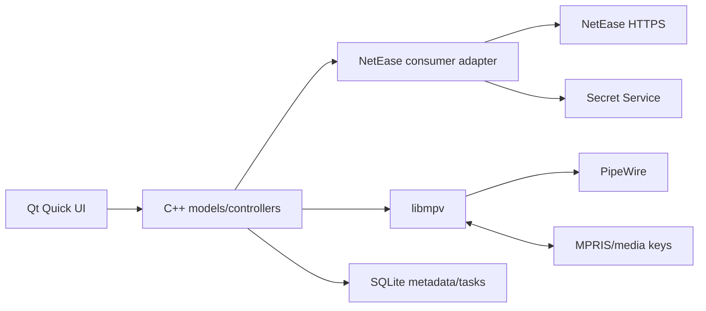

# 云间 — native NetEase music for Omarchy

Design v2 · 13 September 2026 · Working name, not a published brand

A compact, complete desktop music application: ordinary NetEase QR login, personalized Home, discovery, a synchronized music library and a persistent player. Native C++/Qt6/QML, system libmpv and Omarchy theme integration. The service adapter implements community-maintained consumer protocols and connects directly to NetEase. No developer enrollment, app ID, private-key registration or business partnership is part of setup.

This is the selected second option, superseding the earlier official-access study. The original five proposals are historical research; five new context-free reviewers assess this finished design. [Interactive preview](preview.html) · [Feature coverage](COVERAGE.md) · [Protocol investigation](NO-PARTNER.md).

The preview uses fictional fixtures and simulated controls. It is a design artifact, not the production toolkit or a connected client. A designed workflow, existing upstream code and a tested account function are distinct states.

## 1. Product rules

- Listening and finding music take precedence. One primary action per section; infrequent controls appear on demand.
- Four destinations, one persistent player, one optional context panel. Compact appearance reduces simultaneous controls, not feature scope.
- Display actual service metadata, account collection state, quality, availability and timestamps. No substitute sources or invented personalized rankings.
- Setup uses normal account authorization. Explain the unofficial integration once in About/login help rather than interrupting ordinary use.

## 2. Navigation and workflows

| Surface | Main content | Secondary actions |
|---|---|---|
| 首页 / Home | Daily recommendations, personal FM, recommended playlists, resume listening | Refresh; full collection; sign-in/stale-data state |
| 发现 / Discover | Playlists, charts, new music, artists, podcasts, MV/video | Category selector, search, details, follow/save |
| 我的音乐 / Library | Likes, playlists, albums/artists, podcast subscriptions, history/purchases | Cloud, downloads, local folders; create/import/edit playlists |
| 动态 / Activity | Followed people and music posts | Profile, follow, share/publish; inbox and notices in header |
| Persistent player | Cover/title/artist, like, previous/play/next, seek/time, volume | Queue, lyrics, overflow: repeat/shuffle, quality, output, sleep, together, mini-player |
| Context panel | Exactly one of queue, lyrics or comments | Reorder/remove; translation/word lyrics; threads/replies |
| Account menu | Identity, login/logout, settings | Switch account, membership/purchases, creator tools, help |

Home uses a small set of server-ranked recommendations. Signed-out discovery is labeled accordingly. Discover and Library use compact category selectors and tabs that fold into selectors at narrow widths. Preserve filters, selection and scroll position across detail pages and Back.

Track rows show number/playing marker, title/artist, album, duration and overflow. Restricted availability is explicit; actual quality is in the player. Clicking row background selects; Enter/double click plays. An explicitly labeled play button in the title cell is a single-click shortcut; checkboxes and Shift/Ctrl select ranges/items. Artist and album links open details. Hover-only actions also exist in keyboard-accessible menus. Selected rows reveal one contextual bar: count, clear, queue, add to playlist, download and, for owned playlists, remove/reorder. Reordering has keyboard Move up/down equivalents. Report per-item success/unsupported/failure after bulk operations; playlist removal never deletes a local file.

Playlist create/edit uses one form for name, description, privacy and cover. Track actions: Play next, Add to queue/playlist, Like, Download, Album/artist, Comments, Share. Show actions appropriate to resource/ownership. Unsupported required operations remain release gaps in the coverage ledger.

Creation can request public/private. Existing playlist privacy is read-only unless the exact transition is supported: the inspected consumer operation proves private → public, not public → private. The reverse transition remains Investigate. Playlist import is a Library task: preview source/matching, create once, persist task ID, poll status with backoff, show unmatched/partial outcomes, then reconcile actual imported collections. Task acceptance is not completion; ambiguous creation enters outcome-unknown rather than creating a duplicate task.

Cloud has quota, metadata/match information and upload tasks. Upload uses a file picker, per-file progress, cancel/retry and errors. Downloads separates queued/active/failed/completed tasks. Local folders support scanning, tags, search and missing-file recovery. Keep these collections distinct even when they reference the same song.

Podcast detail has episodes, follow, resume position, played state, speed and sleep timer. MV/video uses a native embedded/full-screen surface, quality, save and comments; a single media session prevents overlapping audio. Activity has feed/profile, follow/unfollow, attachment composer, reply/forward and deletion of one's own posts. Inbox has unread state, history and explicit Send. Listen together is a room sheet with create/join/invite, participants, sync status, host controls and Leave. Creator tools contain podcast/episode forms and upload tasks; missing consumer endpoints are investigated rather than silently excluded.

Library also has **saved video**, **history** and **purchases** as separate categories. Save → Library → saved resource must work for each collectable type. Home's recent-listening link opens History directly; account purchases opens Purchases. Purchases groups albums, tracks and long-form audio by actual ownership rather than recency. Audiobooks/audio dramas reuse the spoken-audio layout with series metadata, ordered chapters, narration, chapter entitlements, resume and permitted downloads. Discover and Search expose this content through the existing category selector; its consumer endpoints remain an explicit investigation item.

Resource details share layout components, not all actions. A user profile shows posts, public playlists and following/followers; an artist shows songs, albums, biography and videos. A podcast shows episodes and subscription; a book shows ordered chapters and ownership; video shows its player. Only owned playlists expose Edit/delete/reorder; Edit preloads existing metadata. Album/artist/video details never expose playlist-edit controls.

Search is a route whose state includes query, resource type, paging cursor, selection and scroll. Result types are songs, playlists, artists, albums, users, podcasts/episodes, video, lyrics and long-form audio; uncertain type mappings remain ledger gaps. Search → detail → Back restores the exact query/category and position; clearing the query returns to the preceding browsing route. A type change cannot show a stale result from the prior type.

**FM mode:** entering saves the manual queue, current item and position, then switches to an explicitly labeled FM session. Next requests/replenishes recommendations; previous returns only to heard FM items. Like persists normally; negative feedback is offered only when the consumer endpoint is verified. Keep a small prefetch buffer; network failure permits retry or Return to queue. Exit restores the manual queue paused at its saved position. Repeat/shuffle are disabled in FM; Listen together requires leaving FM explicitly. Starting a normal collection exits FM and asks whether to replace the saved manual queue when it contains user-added items.

**Ordinary media transitions:** explicit Play on a row uses that exact queue entry if already selected, otherwise appends one entry and plays it; Play all replaces the manual queue with the displayed collection after confirming replacement of user-added pending items. Removing the playing entry detaches it from the pending queue but lets the current track finish; Next uses the following surviving entry, or stops when none remains. Video/spoken playback saves and pauses the manual music session, uses a typed session with its own queue/position/speed, then offers Return to music paused at its saved position. Together suspends the prior session and restores it paused on Leave. Only one session owns media output at a time. Music restores 1× speed. Test these transitions and empty-queue behavior explicitly.

Library uses a local read-through cache: show cache immediately with freshness metadata, refresh on account activation, explicit refresh and page activation when older than five minutes. On reconnect, refresh the visible page and reconcile uncertain mutations before background work. Do not poll the entire library. Open edits retain their base snapshot; on Save, re-fetch relevant remote metadata/order and compare. Merge disjoint changes, or show a focused conflict sheet with remote/local values before overwriting conflicting phone edits. After acknowledgement, invalidate affected list/detail/collection counts. Unknown/deleted IDs are surfaced rather than silently removed. These are initial policies, to tune against actual service rate behavior.

Comment/message/post drafts are keyed by account and typed target, independently of player refresh. Play/pause/seek/like cannot erase a composer or change its target. Preserve drafts through navigation with a visible discard choice; clear private account drafts on explicit logout according to the stated account-retention rule.

## 3. Omarchy house style

Qt fits the installed Quickshell/Qt stack; this is not a claim that Omarchy mandates one app toolkit. The application is a normal Wayland window with compositor-owned borders.

| Token | Current laptop | Rule |
|---|---|---|
| Background / panel | `#1a1b26` / `#13141c` | Active palette, opaque reading surfaces |
| Text / accent | `#a9b1d6` / `#7aa2f7` | Accent for focus, playback and selected navigation |
| Font | UbuntuMono Nerd Font via `monospace` | System alias and CJK fallback; no bundled font |
| Base text | 14 logical px | Read user override; shell type proportions |
| Corners | Square | Track shell/compositor rounding; no fake titlebar |
| State/spacing | Subtle foreground fills; 4/8/12/16/24 px spacing | Read focus/hover/selection tokens; scale with font |

Read `$XDG_STATE_HOME/omarchy/current/theme/colors.toml` and adjacent `shell.toml`, then overlay `$XDG_CONFIG_HOME/omarchy/shell.toml`. Defaults are `~/.local/state` and `~/.config`. Watch parent directory replacements and fontconfig changes; debounce and apply complete token sets atomically, keeping the last valid set during partial writes. Read rounding using a bounded optional Hyprland query at startup/reconfiguration; square fallback elsewhere. No private Quickshell runtime imports or edits to `/usr/share/omarchy`.

The bar's opacity does not become content opacity. Use opaque text surfaces, full-color covers, themed chrome and no gradients, huge backdrop art or permanent decorative animation. Essential text reaches 4.5:1 contrast; meaningful boundaries/focus reach 3:1. Derive a readable text blend if a theme's muted token fails, without changing system files.

At base size 14: 168 px sidebar, 52 px header, 76 px player, 44–48 px track rows, 28–32 px icon targets. A 320 px panel docks only if 640 px remains for content (1128 px total); otherwise it overlays, and below 760 px replaces the content pane with Back. Below 840 px the sidebar is a 56 px icon rail with accessible labels/tooltips, album columns disappear and tabs fold into selectors. Target 640×480 logical px. Short windows retain playback/seek; secondary actions move to overflow. Larger fonts raise row/player minima and compact earlier. Test output scaling separately from font scaling, including mixed-DPI monitor moves.

Ctrl+K or `/` searches outside editors; Space toggles playback outside interactive controls; Alt+Left goes Back; Escape closes the active transient surface and restores trigger focus. Standard Tab/Shift+Tab/arrows, CJK IME, copyable metadata, reduced motion and accessible names/roles/states are required. Announce errors rather than each progress tick. Preserve Omarchy Super shortcuts. Reference: [Qt accessibility](https://doc.qt.io/qt-6/accessible.html).

## 4. Account and accurate state

First launch offers public discovery, local folders and Sign in. QR sign-in shows expiry, waiting/scanned/confirmed, Refresh and Cancel. Approve using the phone's NetEase app. No developer console, API address or app credential fields exist. Additional account verification gets an explicit recovery path through NetEase's normal account flow.

Verify identity before importing collections. Store account secrets in Secret Service, separately per account. Locked keyring uses system unlock; unavailable keyring offers session-only login, never plaintext persistence. No browser-cookie extraction. Logout immediately invalidates local auth, attempts remote logout and clears account secrets/protected state. Switching account cancels account-bound work before replacing models. Public/local data and ordinary user-requested files have separate retention rules.

Switch/logout also increments the playback generation, stops/releases account-bound streams and buffers, retires upload credentials and active room state, and resolves any later playback under the new account. A buffered paid track from the previous account cannot continue merely because its URL is still open. Explicitly imported local files are independent of this protected session state.

Metadata keys are provider + account/public scope + resource kind + original string ID. Carry the typed identity through navigation, artwork keys, relationships and mutations; song ID 123 and album ID 123 are different objects. Availability distinguishes full, preview, membership-required, purchase-required, region-restricted, removed and unknown only when response evidence supports it. A null URL alone is not proof of VIP restriction. Network errors remain network errors. Mutations show pending state, commit after acknowledgement and reconcile ambiguous timeouts; do not blindly retry non-idempotent writes.

Preserve raw stream/detail/privilege evidence. A non-null trial URL plus trial boundaries is Preview; explicit privilege/reason fields may establish membership/purchase/region conditions; missing URL without a supported reason is Unknown/unavailable. Store returned level/codec, expiry and trial range independently from the requested quality. Do not port `check_music`'s lossy “no copyright” convenience result or a URL model that discards trial/null entries. Protocol fixtures include non-null preview URLs and unexplained negative availability.

## 5. Native architecture

One C++20 executable built with CMake, Qt Quick Controls and C++ typed models. The selected provider is app-owned C++ using Qt Network and system OpenSSL, porting necessary MIT-licensed API Enhanced transport/module logic with attribution and a pinned revision. This requires development; a ready-made complete C++ SDK has not been established. Rust and SPlayer implementations are behavioral references, not mandatory dependencies. No Node/Electron/GTK runtime, daemon or public localhost API is planned.

**Provider:** asynchronous requests, cookie jar, CSRF/client state, endpoint-specific WEAPI/EAPI/XEAPI and response decoding. The [inventory](evidence/consumer-module-inventory.json) pins API Enhanced `a8c781fd64faab17fedfd46e0615a2609307f163`. Separate protocol/session keys from user credentials; expire/refresh according to responses. Every request/result carries account generation, cancellation and typed errors. Stale responses cannot update a new account/page. Search debounces/cancels; paging preserves order; read retries/backoff are bounded and honor throttling. Reconcile ambiguous writes before retrying. Protocol fixes ship in tested releases, not downloaded executable scripts.

Each account has its own **SessionContext**, owning its network manager/cookie jar, refresh work and protocol-session keys. Retire the entire context before switching; late Set-Cookie/key-refresh responses can mutate only the retired context. Public anonymous discovery uses a distinct context. Deliberately shared device metadata is non-secret and does not include authentication/session tokens. Test delayed cookie/key refresh across account switches, not just stale model delivery. Reference: [Qt cookie handling](https://doc.qt.io/qt-6/qnetworkcookiejar.html).

| Work | Owner and boundary |
|---|---|
| QML/models/navigation | GUI thread; immutable results applied through queued delivery |
| HTTP/session lifecycle | Provider QThread; manager, replies and cookie jar stay in that thread |
| JSON/crypto/art/local scanning | Bounded worker pool; cancellation, size limits, no direct model writes |
| SQLite/tasks | One serialized DB owner; each connection used only by its owning thread |
| Audio/video events | mpv event owner; queued state updates; render resources only on Qt render thread |

Start with six metadata requests, two transfers and two decode jobs in flight; reserve playback resolution ahead of bulk work and cap pending pagination/scan work. Limits are tuning defaults, not performance claims. Test scrolling and playback while scanning, uploading and paging concurrently. References: [Qt network ownership](https://doc.qt.io/qt-6/qnetworkaccessmanager.html), [Qt SQL ownership](https://doc.qt.io/qt-6/qsqldatabase.html).

**Player:** one audio/video owner; queue entries have unique IDs even for repeated songs; callbacks carry a playback generation. libmpv is asynchronous, with Qt Quick render-thread synchronization and a validated graphics backend for video. PipeWire routes audio. Disable user mpv configuration, automatic scripts and duplicate MPRIS plugins in the embedded instance. Publish one application MPRIS service with accurate live capabilities. Reference: [mpv native API](https://mpv.io/manual/stable/#c-api).

Choose Qt Quick's **OpenGL backend**, set before creating the first window, and embed libmpv using a render-thread-owned `QQuickFramebufferObject` adapter. This API is OpenGL-specific; it is not a promise of transparent Vulkan compatibility. Create/destroy the mpv render context with the correct GL context current. Detach callbacks and destroy the render context before its surface/GL context, and before destroying the mpv core at Quit. Window hide/reopen recreates visual resources without replacing the media owner. Gate this architecture early with a local video-file spike covering handoff, fullscreen, surface recreation, background close/reopen and mixed DPI. An unsupported renderer is a named video gap. Reference: [Qt framebuffer integration](https://doc.qt.io/qt-6/qquickframebufferobject.html).

Resolve streams just before play, retaining expiry, actual codec/quality and preview boundaries. Refresh expired URLs and restore position only if still entitled. Seek/next races ignore older results. Failed tracks show Retry/Skip and a supported reason; three consecutive automatic failures stop playback. Persist queue order, shuffle history and per-episode resume state. Suspend pauses; resume stays paused. Default close quits/stops. Explicit background-playback setting keeps the single process/MPRIS session alive; launch raises it; Quit always stops.

Together is a separate feasibility proof: identify the inbound state/event source, command sequence, playlist version, clock/time fields, heartbeat and reconnect snapshot rules. The existing outbound modules do not prove guest synchronization or guest-only leave. Test two consumers with unequal entitlements: each resolves its own media, never shares playable URLs/credentials; handle remote seek, missed events, resync and guest leave without ending the host room. Unknown receive/leave semantics remain a required capability gap.

**Storage/network:** SQLite WAL and bounded artwork LRU. No cookies or signed media URLs in logs. TLS verification enabled; auth only to appropriate NetEase origins; no account cookies on media redirects. Uploads use scoped service-provided credentials. Validate URI schemes, attachment limits, paths and metadata lengths. Download into temporary files and atomically finalize after integrity checks; resume only when supported. Streaming cache is distinct from authorized downloading. Protected offline formats require entitlement/native-playback proof before claiming support.

Durable tasks record a UUID, account/typed resource, operation, state, progress, remote IDs, temporary/final paths, expected integrity and last acknowledged step. States include queued, running, paused, outcome-unknown, complete, failed and canceled. Persist intent before remote writes. On restart reconcile unknown outcomes against remote state before replay; publication is never automatically duplicated. Reconcile finalized files against the task/integrity record without overwriting unrelated files. On Quit, stop accepting work/room heartbeats, cancel transfers, allow up to two seconds to record interrupted/unknown states, then exit. Test process termination immediately before/after remote acknowledgement and local file finalization.

Protocol regression tests use deterministic encoding/decoding vectors with injected time/randomness, sanitized request/response fixtures and a map of each native method to its upstream module and helper dependencies. Compare with the pinned reference in development; Node is a development oracle only, not a shipped dependency. Record verification date/version/account capability for each family, and rerun focused live QR/playback acceptance when transport code changes.

**Packaging:** Arch PKGBUILD with system Qt6 base/declarative/wayland, mpv, libsecret, SQLite, OpenSSL and needed Qt image-format support; a small attributed QR renderer. Qt DBus/network/SQL and portal file picking where available. Include desktop entry/icon, single-instance activation and validated NetEase URL handler. Room links require explicit Join. Package dependency notices; rebuild/smoke-test rolling Qt/libmpv changes. No shell plugin is required for ordinary media controls.

## 6. Full scope and release plan

[COVERAGE.md](COVERAGE.md) records all core functions, native entry points, source evidence and acceptance. A visible button or upstream endpoint does not establish delivery. Purchases/membership may use NetEase's normal web checkout; entitlement/purchased-library sync stays native. Account recovery, live broadcasting, shopping/ticketing, creator analytics and promotional games are ancillary services, not claimed as native desktop music parity. Podcast publishing and music identification remain explicit investigation items. A missing required row must be reported as a gap, never silently dropped.

Implementation slices preserve the final scope:

1. Native/protocol proof: QR/identity, personalized Home/Library, entitled full playback, actual quality, expiry/relogin, plus the local Qt/libmpv video lifecycle spike. Validate the adapter/rendering before committing to broad UI implementation.
2. Daily player: complete Home/Discover/Library, playlist edits, lyrics, queue, theme, MPRIS, local library and packaging.
3. Remaining core app: cloud uploads, permitted downloads, podcasts/video, Activity/inbox/together and all ledger rows.
4. Release checks: keyboard/accessibility, account isolation, large libraries, task failure/recovery and rolling-system integration; explicitly document unresolved capabilities.

Every required ledger row must pass before a release is described as **full/complete**. Earlier builds are explicitly Preview or Daily-player builds. Documenting a gap does not waive it; an infeasible core capability triggers a design/scope decision, not an automatic omission. Re-estimate after the first proof and each unresolved protocol family; no calendar estimate overrides this gate.

Planning estimate: 1–2 engineer-weeks for protocol proof, 8–12 more for daily-player scope, 12–20 more for remaining functions/hardening. Roughly 5–8 months for one experienced engineer or 3–5 months for two, conditional on protocol/protected-media findings. These are estimates, not measured promises.

## 7. Acceptance and independent review

Verify free, entitled paid, preview and unavailable tracks; URL expiry and network loss. Membership or metadata success alone is not playback proof. Test create/edit/delete of a test playlist, paging beyond 1,000 items, a 10,000-track virtualized library, duplicate queue entries and out-of-order results. Switch accounts during search/upload/playback with no old-account result or credential leakage. Exercise disk-full, keyring lock, malformed media, cancellation, resume and session expiry. Social publication requires an explicitly initiated user action.

Test 640×480, 960×720 and 1280×800; font 14/18/24; light/dark themes; keyboard, IME, reduced motion and mixed DPI. HTML checks verify prototype behavior only, not Qt accessibility, native media or service integration. Performance targets to measure: warm open under 1 s, cached navigation under 100 ms, no GUI-thread network/decoding, low static idle CPU and bounded artwork memory.

Five context-free reviewers receive the same four requirements and the ready artifacts, with independent concerns: product coverage, native architecture, consumer protocol/account behavior, visual/accessibility fit, and adversarial completeness. Each writes separately without reading other reviews. Accepted fixes and remaining limitations are recorded in REVIEWS.md.
